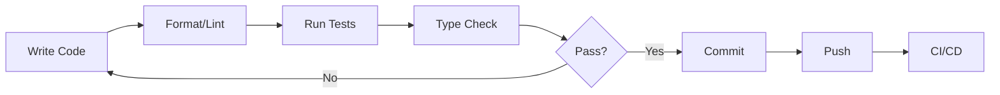

# CLAUDE.md - AI Assistant Guide

> **Purpose**: This document provides comprehensive guidance for AI assistants (like Claude) working on the Raspberry Pi USB Cloner codebase. It covers architecture, conventions, workflows, and common tasks.

**Last Updated**: 2026-01-24
**Project**: Raspberry Pi USB Cloner
**Language**: Python 3.8+
**License**: MIT

---

## Table of Contents

1. [Project Overview](#1-project-overview)
2. [Architecture & Design Patterns](#2-architecture--design-patterns)
3. [Directory Structure](#3-directory-structure)
4. [Key Conventions](#4-key-conventions)
5. [Development Workflow](#5-development-workflow)
6. [Testing Guidelines](#6-testing-guidelines)
7. [Common Tasks](#7-common-tasks)
8. [Known Issues & Gotchas](#8-known-issues--gotchas)
9. [Critical Safety Rules](#9-critical-safety-rules)
10. [File References](#10-file-references)

---

## 1. Project Overview

### What It Does
A hardware-based USB cloning solution for Raspberry Pi Zero/Zero 2 with:
- **OLED Display UI**: 128x64 pixel display with 7-button navigation
- **Web UI**: Real-time display streaming via WebSocket (port 8000)
- **Cloning Modes**: Smart (partclone), Exact (dd), Verify (with SHA256)
- **Clonezilla Integration**: Create and restore Clonezilla-compatible images
- **Device Management**: Auto-detection, mounting, formatting, erasure

### Technology Stack

| Component | Technology | Version |
|-----------|------------|---------|
| **Language** | Python | 3.8+ |
| **Display** | Adafruit 128x64 OLED (SSD1306) via I2C | - |
| **GPIO** | RPi.GPIO | 0.7.1 |
| **Web Server** | aiohttp (async HTTP + WebSocket) | 3.9.5 |
| **UI Framework** | Tabler (Bootstrap 5-based) | - |
| **Image Processing** | Pillow | 10.1.0 |
| **Display Drivers** | luma.oled, luma.core | 3.12.0, 2.4.2 |
| **System Monitoring** | psutil | 5.9.8 |
| **Testing** | pytest, pytest-cov, pytest-mock | ≥7.4.0 |
| **Code Quality** | Black, Ruff, mypy | 24.8.0, ≥0.1.0, 1.11.2 |

### Hardware Requirements
- **Raspberry Pi Zero / Zero 2**
- **Adafruit 128x64 1.3" OLED Bonnet** (I2C address 0x3C or 0x3D)
- **Zero4U USB Hub** (4-port)
- **I2C enabled** via raspi-config or `/boot/config.txt`

### Entry Points
```bash
# Main entry point
/home/user/Rpi-USB-Cloner/rpi-usb-cloner.py
    ↓
rpi_usb_cloner/main.py (892 lines)
    ↓
Main event loop with GPIO polling, USB detection, display rendering
```

---

## 2. Architecture & Design Patterns

### Core Patterns

#### A. Event-Driven Polling Loop
**Location**: `rpi_usb_cloner/main.py:main()`

The application uses synchronous polling (not async event handlers):
```python
# Main loop structure
while True:
    # 1. Poll GPIO buttons (20ms intervals)
    button_event = get_button_press()

    # 2. Detect USB device changes (2s intervals)
    if time_since_last_check > 2.0:
        refresh_device_list()

    # 3. Manage screensaver (idle timeout)
    if idle_time > screensaver_timeout:
        show_screensaver()

    # 4. Render display updates
    render_current_screen()

    # 5. Dispatch actions
    handle_button_action()
```

**Key Intervals**:
- Button polling: **20ms**
- USB detection: **2 seconds**
- Display refresh: **As needed** (on state change)

#### B. State Management Pattern
Three state containers:

1. **AppContext** (`app/context.py`)
   - Runtime state (current screen, active drive, log buffer)
   - Mutable during execution
   ```python
   @dataclass
   class AppContext:
       current_screen: MenuScreen
       active_drive: Optional[str]
       log_buffer: List[str]
       is_busy: bool
       # ... etc
   ```

2. **AppState** (`app/state.py`)
   - Configuration values and timing intervals
   - Loaded from settings at startup
   ```python
   @dataclass
   class AppState:
       screensaver_enabled: bool
       screensaver_timeout: int
       restore_partition_mode: str
       # ... etc
   ```

3. **MenuNavigator** (`menu/navigator.py`)
   - Tracks menu position via stack
   - Handles navigation (up, down, select, back)

#### C. Service Layer Pattern
**Location**: `services/`

Decouples UI from low-level operations:
- `services/drives.py` - Drive listing, selection, labels
- `services/wifi.py` - WiFi management

Always use service layer functions instead of direct device operations.

#### D. Factory/Builder Pattern
**Location**: `app/menu_builders.py`

Dynamically constructs menu items based on runtime state:
```python
def build_drive_menu(context: AppContext) -> List[MenuItem]:
    """Build menu items for available drives."""
    drives = list_media_drive_names()
    return [MenuItem(label=drive, action=select_drive) for drive in drives]
```

#### E. Command Runner Pattern
**Location**: `storage/clone/command_runners.py`

Wraps system commands with progress tracking:
```python
def run_with_progress(
    command: List[str],
    progress_callback: Callable[[int, int], None]
) -> None:
    """Execute command and report progress."""
```

---

## 3. Directory Structure

```
Rpi-USB-Cloner/
├── rpi-usb-cloner.py              # Entry point script
├── rpi_usb_cloner/                # Main package (93 files, ~20,000 LOC)
│   ├── main.py                    # Main event loop (892 lines) ⭐
│   │
│   ├── app/                        # Application state
│   │   ├── context.py             # AppContext (runtime state) ⭐
│   │   ├── state.py               # AppState (configuration)
│   │   ├── menu_builders.py       # Dynamic menu construction
│   │   └── drive_info.py          # Drive information display
│   │
│   ├── menu/                       # Menu system
│   │   ├── model.py               # MenuItem, MenuScreen data classes
│   │   ├── navigator.py           # MenuNavigator (navigation logic) ⭐
│   │   ├── definitions/           # Menu structure definitions
│   │   │   ├── main.py            # Main menu
│   │   │   ├── drives.py          # Drives submenu
│   │   │   ├── images.py          # Images submenu
│   │   │   ├── tools.py           # Tools submenu
│   │   │   └── settings.py        # Settings submenu
│   │   └── actions/               # Menu action handlers (deprecated, see actions/)
│   │
│   ├── actions/                    # Action handlers (NEW location)
│   │   ├── drive_actions.py       # Drive operations
│   │   ├── image_actions.py       # Image operations
│   │   ├── tools_actions.py       # Tools operations
│   │   ├── settings_actions.py    # Settings operations
│   │   └── settings/
│   │       ├── system_power.py    # Power management (shutdown, reboot)
│   │       ├── system_utils.py    # System utilities
│   │       ├── update_manager.py  # Update management
│   │       └── ui_actions.py      # UI settings
│   │
│   ├── ui/                         # OLED display UI
│   │   ├── display.py             # Display initialization ⭐
│   │   ├── renderer.py            # Menu/screen rendering ⭐
│   │   ├── keyboard.py            # Virtual keyboard input
│   │   ├── menus.py               # Menu utilities
│   │   ├── screensaver.py         # Screensaver with GIF support
│   │   ├── icons.py               # Lucide icon definitions
│   │   ├── screens/               # Screen renderers
│   │   │   ├── progress.py        # Progress bars with ETA
│   │   │   ├── confirmation.py    # Yes/No dialogs, checkboxes
│   │   │   ├── status.py          # Status messages
│   │   │   ├── info.py            # Information screens
│   │   │   ├── error.py           # Error displays
│   │   │   ├── wifi.py            # WiFi configuration
│   │   │   ├── logs.py            # Log viewer
│   │   │   └── file_browser.py    # File/folder selection
│   │   └── assets/
│   │       ├── fonts/             # Lucide icons, Heroicons
│   │       └── gifs/              # Screensaver GIFs
│   │
│   ├── storage/                    # Storage operations ⭐
│   │   ├── devices.py             # USB device detection (lsblk) ⭐
│   │   ├── mount.py               # Device mounting utilities
│   │   ├── format.py              # Device formatting
│   │   ├── validation.py          # Input validation
│   │   ├── clone.py               # Legacy clone wrapper (deprecated)
│   │   ├── clone/                 # Modern cloning module ⭐
│   │   │   ├── operations.py      # Clone/dd/partclone ops ⭐
│   │   │   ├── progress.py        # Progress tracking
│   │   │   ├── verification.py    # SHA256 verification
│   │   │   ├── erase.py           # Device erasure
│   │   │   ├── models.py          # Helper data models
│   │   │   └── command_runners.py # Command execution utilities
│   │   ├── clonezilla/            # Clonezilla integration ⭐
│   │   │   ├── backup.py          # Create Clonezilla backups
│   │   │   ├── restore.py         # Restore from images
│   │   │   ├── image_discovery.py # Find image repositories
│   │   │   ├── partition_table.py # Partition table operations
│   │   │   ├── verification.py    # Verify images
│   │   │   ├── compression.py     # Compression handling
│   │   │   ├── file_utils.py      # File utilities
│   │   │   └── models.py          # Data models
│   │   └── image_repo.py          # Image repository management
│   │
│   ├── services/                   # Service layer ⭐
│   │   ├── drives.py              # Drive listing/selection/labels
│   │   └── wifi.py                # WiFi utilities
│   │
│   ├── hardware/                   # Hardware abstraction
│   │   ├── gpio.py                # GPIO button input (RPi.GPIO)
│   │   └── virtual_gpio.py        # Virtual GPIO for testing
│   │
│   ├── web/                        # Web UI server ⭐
│   │   ├── server.py              # aiohttp HTTP/WebSocket server
│   │   ├── system_health.py       # System health monitoring
│   │   ├── templates/
│   │   │   └── index.html         # Main web UI
│   │   └── static/
│   │       ├── tabler/            # Tabler CSS framework
│   │       └── favicon/           # Favicons
│   │
│   ├── config/                     # Configuration
│   │   └── settings.py            # Settings persistence (JSON) ⭐
│   │
│   └── __init__.py
│
├── tests/                          # Test suite (30 test files)
│   ├── conftest.py                # Shared fixtures ⭐
│   ├── test_devices.py            # Device detection tests
│   ├── test_clone*.py             # Cloning tests (5 files)
│   ├── test_clonezilla*.py        # Clonezilla tests (6 files)
│   ├── test_actions_*.py          # Action handler tests (3 files)
│   ├── test_settings.py           # Settings tests
│   ├── test_mount_security.py     # Security tests
│   └── test_*.py                  # Other test modules
│
├── pyproject.toml                 # Project config (dependencies, pytest, ruff, mypy)
├── requirements.txt               # Production dependencies
├── requirements-dev.txt           # Development dependencies
├── .pre-commit-config.yaml        # Pre-commit hooks (Black, Ruff, mypy)
├── README.md                      # Installation & usage guide
├── TESTING.md                     # Testing guide
├── CONTRIBUTING.md                # Contribution guidelines
├── TODO.md                        # Feature roadmap & known issues
├── CLAUDE.md                      # AI assistant guide (this file)
├── AGENTS.md                      # Agent-specific documentation
├── LOGGING_IMPROVEMENTS.md        # Logging architecture guide
├── TEST_COVERAGE_ANALYSIS.md      # Test coverage analysis & improvement plan
├── LICENSE                        # MIT License
└── .github/
    ├── workflows/tests.yml        # CI/CD workflow
    ├── COVERAGE-GUIDE.md          # Coverage reporting guide
    └── CI-CD-GUIDE.md             # CI/CD documentation
```

**⭐ = Critical files to understand first**

---

## 4. Key Conventions

### Code Style

#### Python Standards
- **Version**: Python 3.8+ (target for compatibility)
- **Line Length**: 88 characters (Black default)
- **Imports**: Sorted with isort (via Ruff)
- **Type Hints**: Preferred but not strictly enforced
- **Docstrings**: Not required for simple functions, use for complex logic

#### Formatting & Linting
**ALWAYS run before committing:**
```bash
# Format code
black .

# Lint and auto-fix
ruff check --fix .

# Type check
mypy rpi_usb_cloner
```

**Pre-commit hooks** (recommended):
```bash
# Install hooks
pre-commit install

# Run manually
pre-commit run --all-files
```

### Naming Conventions

| Type | Convention | Example |
|------|------------|---------|
| **Files** | `snake_case.py` | `clone_operations.py` |
| **Classes** | `PascalCase` | `MenuNavigator`, `AppContext` |
| **Functions** | `snake_case()` | `list_usb_disks()`, `render_menu()` |
| **Constants** | `UPPER_SNAKE_CASE` | `SETTINGS_PATH`, `BUTTON_A` |
| **Private** | `_leading_underscore` | `_internal_helper()` |
| **Test Files** | `test_*.py` | `test_devices.py` |
| **Test Classes** | `Test*` | `TestUnmountDevice` |
| **Test Methods** | `test_*` | `test_unmount_failure_is_silent` |

### Import Order
Per Ruff configuration (`pyproject.toml`):
```python
# 1. Future imports
from __future__ import annotations

# 2. Standard library
import os
import sys
from pathlib import Path

# 3. Third-party
from PIL import Image
from luma.oled.device import ssd1306

# 4. First-party (rpi_usb_cloner)
from rpi_usb_cloner.app.context import AppContext
from rpi_usb_cloner.storage.devices import list_usb_disks

# 5. Local folder (relative imports)
from .models import MenuItem
```

### Error Handling

#### General Principles
1. **Catch specific exceptions**, not bare `except:`
2. **Display errors to user** via OLED screen (`ui/screens/error.py`)
3. **Log errors** for debugging
4. **Silent failures are dangerous** - always notify user (see Gotchas)

#### Example Pattern
```python
from rpi_usb_cloner.ui.screens.error import render_error_screen

def clone_device(source: str, destination: str) -> None:
    try:
        # Perform operation
        result = subprocess.run(["dd", ...], check=True)
    except subprocess.CalledProcessError as e:
        # Show error to user on OLED
        render_error_screen(
            context,
            title="Clone Failed",
            message=f"Error cloning {source}: {e.stderr}",
            exception=e
        )
        raise  # Re-raise for logging
    except Exception as e:
        # Catch unexpected errors
        render_error_screen(
            context,
            title="Unexpected Error",
            message=str(e),
            exception=e
        )
        raise
```

### Configuration Management

#### Settings Location
**Default**: `~/.config/rpi-usb-cloner/settings.json`
**Override**: Set `RPI_USB_CLONER_SETTINGS_PATH` environment variable

#### Settings API (`config/settings.py`)
```python
from rpi_usb_cloner.config.settings import (
    load_settings,
    save_settings,
    get_setting,
    set_setting,
    get_bool,
    set_bool
)

# Load settings at startup
load_settings()

# Get values
screensaver_enabled = get_bool("screensaver_enabled", default=False)
partition_mode = get_setting("restore_partition_mode", default="k0")

# Set values
set_bool("web_server_enabled", True)
set_setting("screensaver_timeout", 300)

# Persist to disk
save_settings()
```

#### Default Settings
```python
{
    "screensaver_enabled": False,
    "screensaver_mode": "random",  # "random" or "specific"
    "screensaver_gif": None,       # Specific GIF filename
    "restore_partition_mode": "k0",  # k0, k, k1, k2
    "verify_image_hash_timeout_seconds": None,  # None = no timeout
    "screenshots_enabled": False,
    "web_server_enabled": False,
    # ... see config/settings.py for complete list
}
```

---

## 5. Development Workflow

### Initial Setup

```bash
# 1. Clone repository
git clone https://github.com/2wenty2wo/Rpi-USB-Cloner
cd Rpi-USB-Cloner

# 2. Create virtual environment (recommended)
python3 -m venv .venv
source .venv/bin/activate

# 3. Install dependencies
pip install -r requirements.txt      # Production
pip install -r requirements-dev.txt  # Development

# 4. Install pre-commit hooks (optional)
pre-commit install
```

### Development Cycle



```bash
# 1. Create feature branch
git checkout -b feature/add-new-feature

# 2. Make changes
vim rpi_usb_cloner/storage/devices.py

# 3. Format and lint
black .
ruff check --fix .

# 4. Run tests
pytest                              # All tests
pytest tests/test_devices.py        # Specific file
pytest -k "unmount"                 # Pattern match
pytest -m "not slow"                # Skip slow tests

# 5. Type check
mypy rpi_usb_cloner

# 6. Commit with descriptive message
git add .
git commit -m "Add device auto-refresh on USB hotplug"

# 7. Push to branch
git push -u origin feature/add-new-feature

# 8. Create pull request on GitHub
```

### Running the Application

#### On Raspberry Pi
```bash
# Standard mode
sudo -E python3 rpi-usb-cloner.py

# Debug mode (verbose logging)
sudo -E python3 rpi-usb-cloner.py --debug

# With specific partition restore mode
sudo -E python3 rpi-usb-cloner.py --restore-partition-mode k1
```

**Why `sudo -E`?**
- `sudo` - Required for disk operations (mount, dd, partclone)
- `-E` - Preserves environment variables (PATH, VIRTUAL_ENV, etc.)

#### On Development Machine (without hardware)
```bash
# Use virtual GPIO for testing
export USE_VIRTUAL_GPIO=1
python3 rpi-usb-cloner.py --debug
```

### Git Branching Strategy

#### Branch Naming
- **Feature branches**: `feature/description` or `claude/description-ID`
- **Bug fixes**: `fix/description` or `bugfix/description`
- **Documentation**: `docs/description`
- **Refactoring**: `refactor/description`

#### Commit Message Format
```
<type>: <description>

[optional body]

[optional footer]
```

**Types**: `feat`, `fix`, `docs`, `style`, `refactor`, `test`, `chore`

**Examples**:
```
feat: Add USB hotplug detection

Implement inotify-based monitoring for /dev/disk/by-id changes.
Automatically refreshes drive list when USB devices are added/removed.

Closes #123
```

```
fix: Prevent cloning device to itself

Add validation to check source != destination before starting clone.
Show error dialog if user selects same drive for both.

Fixes #456
```

### Pull Request Guidelines

1. **Title**: Clear, concise description (< 72 chars)
2. **Description**:
   - What changed and why
   - Testing performed
   - Screenshots (for UI changes)
3. **Checklist**:
   - [ ] Tests pass (`pytest`)
   - [ ] Code formatted (`black .`)
   - [ ] Linted (`ruff check --fix .`)
   - [ ] Type checked (`mypy rpi_usb_cloner`)
   - [ ] Documentation updated (if needed)
   - [ ] TODO.md updated (if fixes known issue)

---

## 6. Testing Guidelines

### Test Infrastructure

**Framework**: pytest (≥7.4.0)
**Coverage Target**: No enforced minimum (aim for >80% on critical paths)
**Test Files**: 30 test modules (as of 2026-01-24)
**Current Coverage**: ~34.57% overall (see TEST_COVERAGE_ANALYSIS.md for details)

### Running Tests

```bash
# All tests with coverage
pytest

# Verbose with missing lines
pytest -v --cov-report=term-missing

# Specific test file
pytest tests/test_devices.py

# Specific test class
pytest tests/test_devices.py::TestUnmountDevice

# Specific test method
pytest tests/test_devices.py::TestUnmountDevice::test_unmount_failure_is_silent

# Pattern matching
pytest -k "unmount"
pytest -k "clone and not slow"

# By marker
pytest -m unit                  # Unit tests only
pytest -m integration           # Integration tests only
pytest -m "not slow"            # Skip slow tests
pytest -m hardware              # Hardware tests (requires Pi)

# Stop on first failure
pytest -x

# Generate HTML coverage report
pytest --cov-report=html
open htmlcov/index.html
```

### Test Markers

Defined in `pyproject.toml`:
```python
@pytest.mark.unit          # Fast, isolated unit tests
@pytest.mark.integration   # Multi-component tests
@pytest.mark.slow          # Tests taking >1 second
@pytest.mark.hardware      # Requires actual hardware
```

### Writing Tests

#### Test File Structure
```python
"""
Test module for device detection and management.

Tests cover:
- USB device listing
- Device mounting/unmounting
- Safety checks for system partitions
"""
import pytest
from unittest.mock import Mock, patch

from rpi_usb_cloner.storage.devices import list_usb_disks


class TestDeviceDetection:
    """Test USB device detection."""

    def test_list_usb_disks_success(self, mocker):
        """Test successful device listing with lsblk."""
        # Arrange
        mock_run = mocker.patch("subprocess.run")
        mock_run.return_value.stdout = '{"blockdevices": [...]}'

        # Act
        devices = list_usb_disks()

        # Assert
        assert len(devices) > 0
        assert devices[0]["name"] == "sda"

    @pytest.mark.slow
    def test_large_device_scan(self):
        """Test scanning many devices (slow)."""
        # ...
```

#### Available Fixtures (`tests/conftest.py`)

```python
# Device fixtures
def test_with_device(mock_usb_device):
    """mock_usb_device: Complete USB device dict."""
    assert mock_usb_device["name"] == "sda"

def test_with_system_disk(mock_system_disk):
    """mock_system_disk: Non-removable system disk."""
    assert mock_system_disk["rm"] == "0"

# Subprocess fixtures
def test_command_success(mock_subprocess_success):
    """All subprocess calls succeed."""
    result = subprocess.run(["echo", "test"])
    assert result.returncode == 0

def test_command_failure(mock_subprocess_failure):
    """All subprocess calls raise CalledProcessError."""
    with pytest.raises(subprocess.CalledProcessError):
        subprocess.run(["false"], check=True)

# Settings fixtures
def test_settings(temp_settings_file, sample_settings_data):
    """temp_settings_file: Path to temp JSON file."""
    """sample_settings_data: Dict with typical settings."""
    temp_settings_file.write_text(json.dumps(sample_settings_data))
```

#### Mocking Best Practices

**Mock subprocess calls:**
```python
def test_clone_operation(mocker):
    # Mock subprocess.run
    mock_run = mocker.patch("subprocess.run")
    mock_run.return_value = Mock(returncode=0, stdout="Success")

    # Test function that calls subprocess
    result = clone_device("/dev/sda", "/dev/sdb")

    # Verify subprocess was called correctly
    mock_run.assert_called_once_with(
        ["dd", "if=/dev/sda", "of=/dev/sdb"],
        check=True,
        capture_output=True
    )
```

**Mock file operations:**
```python
def test_settings_load(temp_settings_file, monkeypatch):
    # Override SETTINGS_PATH
    monkeypatch.setattr(
        "rpi_usb_cloner.config.settings.SETTINGS_PATH",
        temp_settings_file
    )

    # Write test data
    temp_settings_file.write_text('{"key": "value"}')

    # Test
    load_settings()
    assert get_setting("key") == "value"
```

#### Parametrized Tests

```python
@pytest.mark.parametrize("filesystem,expected", [
    ("vfat", "FAT32"),
    ("ext4", "ext4"),
    ("ntfs", "NTFS"),
    ("exfat", "exFAT"),
])
def test_filesystem_format(filesystem, expected):
    assert format_filesystem_type(filesystem) == expected
```

### Coverage Reports

```bash
# Terminal report with missing lines
pytest --cov-report=term-missing

# HTML report (interactive)
pytest --cov-report=html
open htmlcov/index.html

# XML report (for CI/CD)
pytest --cov-report=xml
```

**Coverage configuration** (`pyproject.toml`):
- **Source**: `rpi_usb_cloner/` only
- **Omit**: Tests, caches, site-packages
- **Branch coverage**: Enabled
- **Report formats**: term-missing, HTML, XML

### CI/CD Testing

**GitHub Actions**: `.github/workflows/tests.yml`

Runs on:
- Push to `main`, `master`, `claude/*` branches
- Pull requests to `main`, `master`

Workflow:
1. Checkout code
2. Set up Python 3.11
3. Install dependencies
4. Run pytest with coverage
5. Display coverage summary
6. Upload coverage reports as artifacts

**View results**:
- GitHub Actions tab → Tests workflow
- Download `coverage-reports` artifact for HTML report

---

## 7. Common Tasks

### Adding a New Menu Item

**1. Define menu item in `menu/definitions/`**

Edit appropriate file (e.g., `menu/definitions/tools.py`):
```python
from rpi_usb_cloner.menu.model import MenuItem, MenuScreen

def get_tools_menu() -> MenuScreen:
    return MenuScreen(
        title="Tools",
        items=[
            # ... existing items ...
            MenuItem(
                label="New Tool",
                icon="icon_tool",  # Optional, see ui/icons.py
                action="new_tool_action"  # Action name (string)
            ),
        ]
    )
```

**2. Implement action handler in `actions/`**

Edit appropriate file (e.g., `actions/tools_actions.py`):
```python
def new_tool_action(context: AppContext) -> None:
    """Handle new tool action."""
    # Show confirmation dialog
    from rpi_usb_cloner.ui.screens.confirmation import render_confirmation

    confirmed = render_confirmation(
        context,
        title="New Tool",
        message="Are you sure?",
        default=False
    )

    if confirmed:
        # Perform operation
        try:
            result = perform_tool_operation()

            # Show success
            from rpi_usb_cloner.ui.screens.status import render_status
            render_status(context, "Success!", "Operation completed")
        except Exception as e:
            # Show error
            from rpi_usb_cloner.ui.screens.error import render_error_screen
            render_error_screen(context, "Error", str(e), exception=e)
```

**3. Register action in `main.py`**

In `rpi_usb_cloner/main.py`, add to action dispatcher:
```python
from rpi_usb_cloner.actions.tools_actions import new_tool_action

# In main() function, add to action mapping:
ACTION_MAP = {
    # ... existing actions ...
    "new_tool_action": new_tool_action,
}
```

### Adding a New Screen Renderer

**1. Create renderer in `ui/screens/`**

Create `ui/screens/my_screen.py`:
```python
"""Custom screen renderer."""
from typing import Optional
from PIL import Image, ImageDraw

from rpi_usb_cloner.app.context import AppContext
from rpi_usb_cloner.ui.display import DisplayContext


def render_my_screen(
    app_ctx: AppContext,
    display_ctx: DisplayContext,
    title: str,
    content: str,
    icon: Optional[str] = None
) -> None:
    """
    Render custom screen.

    Args:
        app_ctx: Application context
        display_ctx: Display context
        title: Screen title
        content: Screen content
        icon: Optional icon name (see ui/icons.py)
    """
    # Create image buffer (128x64, 1-bit monochrome)
    image = Image.new("1", (128, 64), 0)
    draw = ImageDraw.Draw(image)

    # Draw title bar (top 12-16 pixels)
    y_pos = 0
    if icon:
        # Draw icon (if available)
        icon_char = display_ctx.icons.get(icon, "")
        draw.text((2, y_pos), icon_char, font=display_ctx.icon_font, fill=1)
        x_offset = 16
    else:
        x_offset = 2

    # Draw title text
    draw.text((x_offset, y_pos), title, font=display_ctx.font_small, fill=1)
    y_pos += 14

    # Draw separator line
    draw.line([(0, y_pos), (128, y_pos)], fill=1)
    y_pos += 2

    # Draw content
    draw.text((2, y_pos), content, font=display_ctx.font_small, fill=1)

    # Update display
    display_ctx.device.display(image)

    # Update app context
    app_ctx.current_screen_image = image
```

**2. Use in action handler**

```python
from rpi_usb_cloner.ui.screens.my_screen import render_my_screen

def my_action(context: AppContext) -> None:
    render_my_screen(
        context,
        context.display,
        title="My Screen",
        content="Hello, World!",
        icon="icon_info"
    )
```

### Adding a New Storage Operation

**1. Implement operation in `storage/`**

Create `storage/my_operation.py`:
```python
"""Custom storage operation."""
import subprocess
from typing import Callable, Optional

from rpi_usb_cloner.storage.clone.command_runners import run_with_progress


def my_storage_operation(
    device: str,
    progress_callback: Optional[Callable[[int, int], None]] = None
) -> None:
    """
    Perform custom storage operation.

    Args:
        device: Device path (e.g., "/dev/sda")
        progress_callback: Optional progress callback(current, total)

    Raises:
        subprocess.CalledProcessError: If operation fails
        ValueError: If device is invalid
    """
    # Validate device
    if not device.startswith("/dev/"):
        raise ValueError(f"Invalid device path: {device}")

    # Check device exists
    if not os.path.exists(device):
        raise ValueError(f"Device not found: {device}")

    # Build command
    command = ["my_tool", "--device", device]

    # Execute with progress tracking
    if progress_callback:
        run_with_progress(command, progress_callback)
    else:
        subprocess.run(command, check=True, capture_output=True, text=True)
```

**2. Add service layer wrapper in `services/drives.py`** (optional)

```python
def perform_my_operation(device_name: str) -> None:
    """Perform operation on device (service layer)."""
    from rpi_usb_cloner.storage.my_operation import my_storage_operation
    from rpi_usb_cloner.storage.devices import get_device_by_name

    # Get full device info
    device = get_device_by_name(device_name)
    if not device:
        raise ValueError(f"Device not found: {device_name}")

    # Perform operation
    device_path = f"/dev/{device['name']}"
    my_storage_operation(device_path)
```

**3. Write tests in `tests/`**

Create `tests/test_my_operation.py`:
```python
"""Tests for custom storage operation."""
import pytest
from unittest.mock import Mock, patch

from rpi_usb_cloner.storage.my_operation import my_storage_operation


class TestMyOperation:
    def test_success(self, mocker):
        """Test successful operation."""
        mock_run = mocker.patch("subprocess.run")
        mock_run.return_value = Mock(returncode=0, stdout="Success")

        my_storage_operation("/dev/sda")

        mock_run.assert_called_once()

    def test_invalid_device(self):
        """Test with invalid device path."""
        with pytest.raises(ValueError, match="Invalid device path"):
            my_storage_operation("invalid")

    def test_device_not_found(self):
        """Test with non-existent device."""
        with pytest.raises(ValueError, match="Device not found"):
            my_storage_operation("/dev/nonexistent")
```

### Adding a New Setting

**1. Add default value in `config/settings.py`**

```python
DEFAULT_SETTINGS = {
    # ... existing settings ...
    "my_new_setting": "default_value",
}
```

**2. Add getter/setter helpers** (optional)

```python
def get_my_setting() -> str:
    """Get my setting value."""
    return get_setting("my_new_setting", default="default_value")

def set_my_setting(value: str) -> None:
    """Set my setting value."""
    set_setting("my_new_setting", value)
    save_settings()
```

**3. Add menu item to change setting**

In `menu/definitions/settings.py`:
```python
MenuItem(
    label=f"My Setting: {get_my_setting()}",
    action="change_my_setting"
)
```

**4. Implement action handler**

In `actions/settings_actions.py`:
```python
def change_my_setting(context: AppContext) -> None:
    """Change my setting."""
    from rpi_usb_cloner.ui.keyboard import render_keyboard

    # Show keyboard for input
    new_value = render_keyboard(
        context,
        title="My Setting",
        initial_value=get_my_setting()
    )

    if new_value:
        set_my_setting(new_value)

        # Show confirmation
        from rpi_usb_cloner.ui.screens.status import render_status
        render_status(context, "Saved", f"My Setting: {new_value}")
```

### Debugging Tips

#### Enable Debug Logging
```bash
sudo -E python3 rpi-usb-cloner.py --debug
```

#### View Web UI Debug Console
```
http://<pi-ip>:8000/?debug=1
```

Or persist in browser console:
```javascript
localStorage.setItem("rpiUsbClonerDebug", "1")  // Enable
localStorage.removeItem("rpiUsbClonerDebug")    // Disable
```

#### Access Logs on Raspberry Pi
```bash
# If running as systemd service
sudo journalctl -u rpi-usb-cloner.service -f

# If running in terminal
# Logs appear in stdout/stderr
```

#### Common Debug Points

1. **Device Detection**:
   ```python
   from rpi_usb_cloner.storage.devices import list_usb_disks
   devices = list_usb_disks()
   print(f"Found {len(devices)} devices: {devices}")
   ```

2. **Menu Navigation**:
   ```python
   from rpi_usb_cloner.menu.navigator import MenuNavigator
   print(f"Current menu: {navigator.current_screen.title}")
   print(f"Menu stack depth: {len(navigator.menu_stack)}")
   ```

3. **Settings**:
   ```python
   from rpi_usb_cloner.config.settings import get_all_settings
   print(f"All settings: {get_all_settings()}")
   ```

---

## 8. Known Issues & Gotchas

### Recent Improvements

#### 2026-01-24: UI Enhancements & Test Coverage ✅
**New Features**:
- **Menu Transitions**: Added slide transitions for menu lists with configurable transition speed settings
- **CREATE REPO DRIVE**: New menu option to mark drives as image repositories (creates flag file)
- **Font Optimization**: Removed unused font files to reduce repository size
- **Menu Reorganization**: Refactored menu structure for better organization (Option A implementation)

**Test Coverage**:
- Added comprehensive action handler tests (+38 tests)
- Coverage increased by +7.47% for action modules
- Total test files: 30 (was 26)
- See `TEST_COVERAGE_ANALYSIS.md` for detailed coverage report

**Bug Fixes**:
- Fixed multiple partition mounting for repository detection
- Corrected CLONE menu label rendering (plain text and Lucide icons)
- Resolved mypy type checking issues
- Fixed ruff lint violations
- Improved menu transition footer display

#### 2026-01-23: Unmount Error Handling ✅
**Previous Issue**: `unmount_device()` silently swallowed exceptions, which could lead to data corruption.

**Resolution** (2026-01-23): The function has been significantly improved with:
- `raise_on_failure` parameter for explicit error handling
- Returns `bool` to indicate success/failure
- Raises `UnmountFailedError` when `raise_on_failure=True`
- New `unmount_device_with_retry()` function with retry logic and lazy unmount support
- Proper logging of failed mountpoints
- Error handler integration for UI notifications

**New Signature**:
```python
def unmount_device(device: dict, raise_on_failure: bool = False) -> bool:
    """Returns True if successful, False otherwise. Raises UnmountFailedError if raise_on_failure=True."""

def unmount_device_with_retry(device: dict, log_debug: Optional[Callable] = None) -> tuple[bool, bool]:
    """Returns (success, used_lazy_unmount) with automatic retry logic."""
```

### Current Issues (from TODO.md)

#### 1. UI/UX Issues

**Keyboard Character Selection** (Medium Priority)
- Location: `ui/keyboard.py`
- Issue: Keyboard character selection doesn't show on web UI (only visible on OLED display)
- Impact: Web UI users can't see keyboard input state

**Keyboard Footer Display** (Medium Priority)
- Issue: Keyboard mode bottom footer missing from web UI
- Impact: Missing navigation hints for web UI users

**Text Scrolling Speed** (Low Priority)
- Location: Various menu screens (e.g., 'choose image' screen)
- Issue: Text scrolling speed varies based on text length
- Expected: All items should scroll at consistent speed

**Screensaver Menu Logic** (Low Priority)
- Location: `menu/definitions/settings.py`
- Issue: "Select GIF" option shows even when mode is set to "Random"
- Expected: Only show "Select GIF" when mode is "Selected"

**Web UI OLED Preview** (Low Priority)
- Issue: No fullscreen mode for OLED preview in web UI
- Expected: Hover to show fullscreen icon, click to expand

#### 2. Source != Destination Validation
**Problem**: User can accidentally clone a drive to itself, resulting in data corruption.

**Workaround**: Add validation in clone operations:
```python
def clone_device(source: str, destination: str) -> None:
    if source == destination:
        raise ValueError("Source and destination cannot be the same device!")
    # ... proceed with clone
```

#### 3. USB Hotplug Race Conditions
**Problem**: Device list refreshes every 2 seconds. If USB is unplugged between detection and operation start, operation fails unexpectedly.

**Workaround**:
- Validate device exists immediately before operation
- Implement retry logic for transient failures


### Performance Considerations

#### OLED Refresh Rate
- **Display updates** should be throttled to prevent flickering
- **Text scrolling** speed varies by text length (known issue in TODO.md)
- **Screensaver GIFs** are limited by frame rate (~10-15 fps)

#### USB Detection Interval
- **Current**: 2-second polling interval
- **Trade-off**: Shorter intervals increase CPU usage
- **Consider**: Implement inotify-based detection for instant hotplug response

#### Web UI Performance
- **WebSocket frame rate** is limited to prevent browser lag
- **Large logs** can slow down web UI - implement pagination

### Hardware Quirks

#### I2C Baud Rate
- **Default**: 100 kHz (slow)
- **Recommended**: 1 MHz for faster OLED updates
- **Config**: Add to `/boot/firmware/config.txt`:
  ```ini
  dtparam=i2c_baudrate=1000000
  ```

#### GPIO Button Debouncing
- **Polling interval**: 20ms
- **Debouncing**: Handled in `hardware/gpio.py`
- **Button repeat**: Implemented for smooth navigation

#### Zero4U USB Hub
- **Power limitations**: Pi Zero USB port limited to ~500mA total
- **Recommendation**: Use powered USB hub for multiple drives

---

## 9. Critical Safety Rules

### ALWAYS Do

1. **Validate device paths** before operations
   ```python
   if not device.startswith("/dev/"):
       raise ValueError("Invalid device path")
   ```

2. **Check source != destination** for clone operations
   ```python
   if source == destination:
       raise ValueError("Cannot clone to same device")
   ```

3. **Verify device is removable** before operations
   ```python
   device_info = get_device_by_name(device_name)
   if device_info["rm"] != "1":
       raise ValueError("Device is not removable")
   ```

4. **Check mount points** before operations
   ```python
   if device_info["mountpoint"] in ["/", "/boot", "/boot/firmware"]:
       raise ValueError("Cannot operate on system partition")
   ```

5. **Show errors to user** on OLED display
   ```python
   from rpi_usb_cloner.ui.screens.error import render_error_screen
   render_error_screen(context, "Error", error_message, exception=e)
   ```

6. **Log all operations** for audit trail
   ```python
   import logging
   logger = logging.getLogger(__name__)
   logger.info(f"Starting clone: {source} -> {destination}")
   ```

### NEVER Do

1. **Never skip error handling** on device operations
   ```python
   # ❌ NEVER:
   try:
       subprocess.run(["dd", ...], check=True)
   except:
       pass  # Silent failure!

   # ✅ ALWAYS:
   try:
       subprocess.run(["dd", ...], check=True)
   except subprocess.CalledProcessError as e:
       render_error_screen(context, "Clone Failed", str(e), exception=e)
       raise
   ```

2. **Never operate on non-removable devices**
   ```python
   # ❌ NEVER:
   clone_device("/dev/mmcblk0", "/dev/sda")  # mmcblk0 is SD card!

   # ✅ ALWAYS check:
   device = get_device_by_name("mmcblk0")
   if device["rm"] != "1":
       raise ValueError("Device is not removable")
   ```

3. **Never assume unmount succeeded without checking return value**
   ```python
   # ❌ NEVER:
   unmount_device(device)
   # Proceed assuming unmounted

   # ✅ ALWAYS check return value or use raise_on_failure:
   success = unmount_device(device, raise_on_failure=False)
   if not success:
       raise RuntimeError("Unmount failed")

   # OR use raise_on_failure=True to automatically raise exception:
   unmount_device(device, raise_on_failure=True)  # Raises UnmountFailedError on failure
   ```

4. **Never perform destructive operations without confirmation**
   ```python
   # ❌ NEVER:
   def format_device(device: str) -> None:
       subprocess.run(["mkfs.ext4", device], check=True)

   # ✅ ALWAYS confirm:
   def format_device_action(context: AppContext) -> None:
       confirmed = render_confirmation(
           context,
           title="Format Device",
           message=f"Erase all data on {device}?",
           default=False
       )
       if not confirmed:
           return
       format_device(device)
   ```

5. **Never commit without running tests**
   ```bash
   # ❌ NEVER:
   git commit -m "Fix bug" && git push

   # ✅ ALWAYS:
   pytest && git commit -m "Fix bug" && git push
   ```

---

## 10. File References

### Essential Files to Understand

| File | LOC | Description |
|------|-----|-------------|
| `rpi_usb_cloner/main.py` | 892 | Main event loop, entry point ⭐ |
| `rpi_usb_cloner/app/context.py` | ~100 | AppContext (runtime state) ⭐ |
| `rpi_usb_cloner/menu/navigator.py` | ~200 | Menu navigation logic ⭐ |
| `rpi_usb_cloner/storage/devices.py` | ~250 | USB device detection ⭐ |
| `rpi_usb_cloner/storage/clone/operations.py` | ~400 | Clone operations ⭐ |
| `rpi_usb_cloner/ui/renderer.py` | ~300 | OLED rendering ⭐ |
| `rpi_usb_cloner/web/server.py` | ~400 | Web server (aiohttp) ⭐ |
| `rpi_usb_cloner/config/settings.py` | ~200 | Settings management ⭐ |

### Configuration Files

| File | Purpose |
|------|---------|
| `pyproject.toml` | Project metadata, dependencies, pytest/ruff/mypy config |
| `requirements.txt` | Production dependencies (6 packages) |
| `requirements-dev.txt` | Development dependencies (pytest, black, mypy, ruff) |
| `.pre-commit-config.yaml` | Pre-commit hooks (Black, Ruff, mypy) |
| `.github/workflows/tests.yml` | CI/CD workflow (GitHub Actions) |

### Documentation Files

| File | Purpose |
|------|---------|
| `README.md` | Installation, usage, quickstart |
| `TESTING.md` | Comprehensive testing guide |
| `CONTRIBUTING.md` | Contribution guidelines |
| `TODO.md` | Feature roadmap, known issues |
| `CLAUDE.md` | This file (AI assistant guide) |
| `AGENTS.md` | Agent-specific documentation |
| `LOGGING_IMPROVEMENTS.md` | Logging architecture and improvements |
| `TEST_COVERAGE_ANALYSIS.md` | Test coverage analysis & improvement plan |
| `.github/COVERAGE-GUIDE.md` | Code coverage reporting guide |
| `.github/CI-CD-GUIDE.md` | Continuous integration documentation |

### Quick Reference: Key Functions

#### Device Management
```python
# storage/devices.py
list_usb_disks() -> List[Dict]          # Get all USB devices (lsblk)
list_media_drive_names() -> List[str]   # Get safe, removable device names
get_device_by_name(name: str) -> Dict   # Get device info by name
unmount_device(device: dict, raise_on_failure: bool = False) -> bool  # Unmount device with error handling
unmount_device_with_retry(device: dict, log_debug: Optional[Callable] = None) -> tuple[bool, bool]  # Retry logic
format_device_label(device: Dict) -> str # Human-readable label

# services/drives.py (preferred)
list_media_drive_labels() -> List[str]  # Get formatted labels with sizes
select_active_drive(name: str) -> None  # Set active drive in context
get_active_drive_label() -> str         # Get active drive label
```

#### Clone Operations
```python
# storage/clone/operations.py
clone_device(
    source: str,
    destination: str,
    mode: str = "smart",  # "smart", "exact", "verify"
    progress_callback: Optional[Callable] = None
) -> None

verify_clone(source: str, destination: str) -> bool
erase_device(device: str, mode: str = "quick") -> None  # "quick" or "full"
```

#### Clonezilla Integration
```python
# storage/clonezilla/backup.py
create_clonezilla_backup(
    device: str,
    output_dir: str,
    image_name: str,
    compression: str = "gzip"
) -> None

# storage/clonezilla/restore.py
restore_clonezilla_image(
    image_path: str,
    destination: str,
    partition_mode: str = "k0"
) -> None

# storage/clonezilla/image_discovery.py
discover_clonezilla_images() -> List[ClonezillaImage]
```

#### UI Rendering
```python
# ui/renderer.py
render_menu(context: AppContext, screen: MenuScreen) -> None

# ui/screens/progress.py
render_progress(
    context: AppContext,
    title: str,
    current: int,
    total: int,
    message: str = ""
) -> None

# ui/screens/confirmation.py
render_confirmation(
    context: AppContext,
    title: str,
    message: str,
    default: bool = False
) -> bool

# ui/screens/error.py
render_error_screen(
    context: AppContext,
    title: str,
    message: str,
    exception: Optional[Exception] = None
) -> None

# ui/screens/status.py
render_status(
    context: AppContext,
    title: str,
    message: str
) -> None
```

#### Settings Management
```python
# config/settings.py
load_settings() -> None                 # Load from JSON
save_settings() -> None                 # Persist to JSON
get_setting(key: str, default: Any) -> Any
set_setting(key: str, value: Any) -> None
get_bool(key: str, default: bool) -> bool
set_bool(key: str, value: bool) -> None
```

#### Menu Navigation
```python
# menu/navigator.py
class MenuNavigator:
    def navigate_up(self) -> None
    def navigate_down(self) -> None
    def select_item(self) -> Optional[str]  # Returns action name
    def go_back(self) -> None
```

---

## Appendix: Quick Command Reference

### Development Commands
```bash
# Format code
black .

# Lint and auto-fix
ruff check --fix .

# Type check
mypy rpi_usb_cloner

# Run all pre-commit hooks
pre-commit run --all-files

# Run tests
pytest                              # All tests with coverage
pytest -v                           # Verbose
pytest -k "pattern"                 # Pattern match
pytest -m "not slow"                # Skip slow tests
pytest tests/test_devices.py        # Specific file

# Generate coverage report
pytest --cov-report=html
open htmlcov/index.html

# Run application (on Pi)
sudo -E python3 rpi-usb-cloner.py
sudo -E python3 rpi-usb-cloner.py --debug
```

### Git Commands
```bash
# Create feature branch
git checkout -b feature/description

# Commit changes
git add .
git commit -m "feat: Add feature description"

# Push to remote
git push -u origin feature/description

# Update from main
git fetch origin
git rebase origin/main
```

### Systemd Service Commands (on Pi)
```bash
# Status
sudo systemctl status rpi-usb-cloner.service

# Start
sudo systemctl start rpi-usb-cloner.service

# Stop
sudo systemctl stop rpi-usb-cloner.service

# Restart
sudo systemctl restart rpi-usb-cloner.service

# View logs
sudo journalctl -u rpi-usb-cloner.service -f
```

---

## Questions or Feedback

If you have questions or suggestions for improving this guide:

1. **Open an issue**: https://github.com/2wenty2wo/Rpi-USB-Cloner/issues
2. **Review documentation**: `README.md`, `TESTING.md`, `CONTRIBUTING.md`
3. **Check TODO**: `TODO.md` for known issues and planned features

---

**Happy Coding! 🚀**
