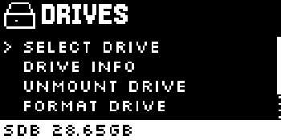
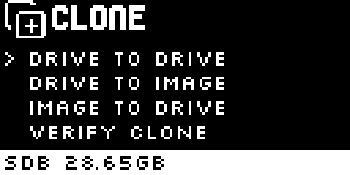
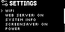
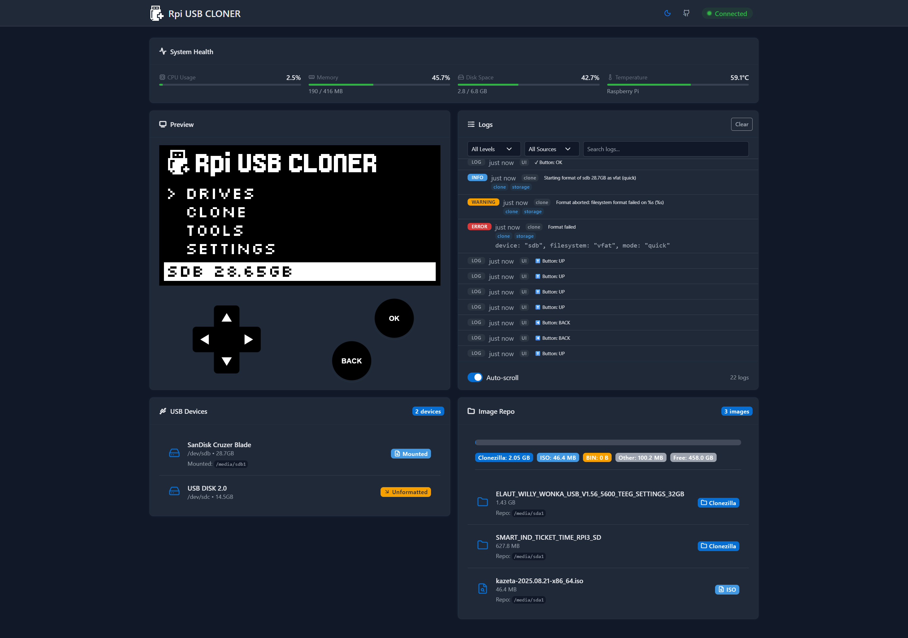

<p align="center">
  
</p>

<p align="center">
  
  
  
  
</p>

# Rpi USB Cloner

A hardware-based USB imaging and cloning solution using a Raspberry Pi Zero/Zero 2, [Adafruit 128x64 1.3" OLED Bonnet](https://www.adafruit.com/product/3531), and [Zero4U USB Hub](https://www.adafruit.com/product/3298) or [Mcuzone Gigabit Ethernet Expansion Board](https://www.aliexpress.com/item/1005003722191832.html). Inspired by [lukehutch/usb-copier](https://github.com/lukehutch/usb-copier).

## ✨ Features

### Imaging Operations
- **Clone USB disk to USB disk** - Direct device-to-device cloning with multiple modes:
  - **Smart mode** (partclone) - Intelligent partition-aware cloning
  - **Exact mode** (dd) - Bit-for-bit exact copies
  - **Verify mode** - Clone with SHA256 verification
- **Backup Disk to Image** - Create Clonezilla-compatible backup images
- **Restore Clonezilla images to Disk** - Restore from Clonezilla backup images
- **Restore Passmark ImageUSB .bin images to Disk** - Support for ImageUSB format
- **Restore ISO image to Disk** - Write ISO files directly to USB drives

### User Interfaces
- **OLED Display UI** - 128x64 pixel display with 7-button navigation for standalone operation
- **Web UI** - Real-time display streaming via WebSocket (port 8000) for remote monitoring and control

### Device Management
- **Auto-detection** - Automatic USB device discovery and monitoring
- **Mounting/Unmounting** - Safe device mounting with retry logic
- **Formatting** - Format devices with various filesystems (FAT32, ext4, NTFS, exFAT)
- **Secure Erasure** - Quick or full device erasure with verification

### Connectivity
- **Bluetooth PAN** - Bluetooth tethering for web UI access and internet without WiFi:
  - QR code for quick web UI access
  - Trusted devices with auto-reconnect
  - Works with iPhone and Android
- **USB-to-USB** - Copy images directly between USB drives on the same Pi
- **Ethernet Direct** - Transfer images between Pis via direct Ethernet (mDNS discovery + HTTP)
- **WiFi Direct** - Peer-to-peer wireless transfer without a router (P2P via `wpa_supplicant`)


## 📸 Screenshots

<table>
  <tr>
    <td>
      
    </td>
    <td>
      
    </td>
    <td>
      
    </td>
  </tr>
  <tr>
    <td>
      
    </td>
    <td>
      
    </td>
    <td></td></td>
  </tr>
</table>
<table>
  <tr>
    <td>
      
    </td>
  </tr>
</table>

## 🚀 Quickstart

Quick setup for experienced users:

```sh
# Clone the repository
git clone https://github.com/2wenty2wo/Rpi-USB-Cloner
cd Rpi-USB-Cloner

# Set up Python virtual environment
python3 -m venv .venv
source .venv/bin/activate

# Install dependencies
pip install -r requirements.txt

# Run the cloner (requires root for disk operations)
sudo -E python3 rpi-usb-cloner.py
```

> **Prerequisites:** I2C must be enabled and hardware properly connected. See the [Installation](#-installation--usage) section below for complete setup instructions.

## 🧰 Installation & Usage

### Installation

#### 1. Clone the repository

Download the source code to your Raspberry Pi:

```sh
git clone https://github.com/2wenty2wo/Rpi-USB-Cloner
cd Rpi-USB-Cloner
```

#### 2. Install dependencies and prepare the Pi

1. **Flash Raspberry Pi OS** (Lite is fine) to your microSD and boot the Pi Zero.

2. **Update system packages** to the latest versions:
   ```sh
   sudo apt update
   sudo apt upgrade -y
   ```

3. **Enable I2C** (required for the Adafruit OLED Bonnet):

   **Option A:** Use raspi-config interactive tool:
   ```sh
   sudo raspi-config
   ```
   Navigate to: *Interface Options → I2C → Enable*, then reboot.

   **Option B:** Manually edit `/boot/config.txt`:
   ```ini
   # Enable I2C for OLED display
   dtparam=i2c_arm=on
   ```

   After enabling I2C, confirm the display address is either **0x3C** or **0x3D**.
   The OLED driver class depends on the panel type, so verify whether your panel is **SSD1306** or **SH1106**.

   <details>
   <summary><strong>Optional: Set faster I2C baud rate (1 MHz) for better display performance</strong></summary>

   1. Open the config file (path depends on your Raspberry Pi OS version):
      ```sh
      # Newer Raspberry Pi OS releases
      sudo nano /boot/firmware/config.txt
      # Older versions may use /boot/config.txt
      ```

   2. Add or update the following line:
      ```ini
      dtparam=i2c_baudrate=1000000
      ```

   3. Save and reboot:
      ```sh
      sudo reboot
      ```
   </details>

4. **Install Python and required system libraries**:
   ```sh
   sudo apt install -y python3 python3-pip python3-dev python3-venv git \
     libopenjp2-7 libfreetype6 libjpeg62-turbo libpng16-16t64 zlib1g partclone \
     bluez bluez-tools bridge-utils dnsmasq
   ```

5. **Install Python dependencies** (Bookworm enforces PEP 668):

   **Option A (recommended): Virtual environment**
   ```sh
   python3 -m venv .venv
   source .venv/bin/activate
   pip install -r requirements.txt
   ```

   **Option B: System Python** (single-use device only)
   ```sh
   sudo pip install --break-system-packages -r requirements.txt
   ```


### Usage

#### Running the cloner

**Basic usage:**
```sh
sudo -E python3 rpi-usb-cloner.py
```

**Debug mode:**
```sh
sudo -E python3 rpi-usb-cloner.py --debug
```

> **Note:** The `-E` flag preserves environment variables. Root permissions are required for disk operations.


**Stop/Restart:**
- Press **Ctrl+C** to stop the running process
- Run the command again to restart

#### Auto-start on boot (systemd)

1. **Create the systemd service file** `/etc/systemd/system/rpi-usb-cloner.service`:
   ```ini
   [Unit]
   Description=Rpi USB Cloner
   After=network.target

   [Service]
   Type=simple
   User=root
   # Update paths to match your installation directory
   WorkingDirectory=/home/pi/Rpi-USB-Cloner
   # For virtual environment (Option A), use the venv Python:
   ExecStart=/home/pi/Rpi-USB-Cloner/.venv/bin/python /home/pi/Rpi-USB-Cloner/rpi-usb-cloner.py
   # For system Python (Option B), use: /usr/bin/python3 /home/pi/Rpi-USB-Cloner/rpi-usb-cloner.py
   Restart=on-failure

   [Install]
   WantedBy=multi-user.target
   ```

   > **Important:** Update `User=` and all paths to match your installation.

2. **Enable and start the service**:
   ```sh
   sudo systemctl daemon-reload
   sudo systemctl enable rpi-usb-cloner.service
   sudo systemctl start rpi-usb-cloner.service
   ```

3. **Manage the service**:
   ```sh
   sudo systemctl stop rpi-usb-cloner.service     # Stop
   sudo systemctl start rpi-usb-cloner.service    # Start
   sudo systemctl restart rpi-usb-cloner.service  # Restart
   sudo systemctl status rpi-usb-cloner.service   # Status
   sudo journalctl -u rpi-usb-cloner.service -f   # View logs
   ```

#### Updating the software

**Via OLED UI:**
- Navigate to: *Settings → Update*

**Via command line:**

<details>
<summary><strong>Fix Git "dubious ownership" error (if needed)</strong></summary>

If you see "dubious ownership" errors when running updates as root:
```sh
sudo git config --global --add safe.directory /home/pi/Rpi-USB-Cloner
```
</details>

**Option A: Virtual environment**
```sh
cd /path/to/Rpi-USB-Cloner
git pull
source .venv/bin/activate
pip install -r requirements.txt
```

**Option B: System Python**
```sh
cd /path/to/Rpi-USB-Cloner
git pull
sudo pip install --break-system-packages -r requirements.txt
```

## 🎨 Assets & Customization

### 🖼️ Screensaver GIFs
Place custom GIFs in `rpi_usb_cloner/ui/assets/gifs/` and the screensaver will automatically pick them up.

### 🔤 Font assets
This project uses Lucide icons; see <https://lucide.dev/license> for license details.
